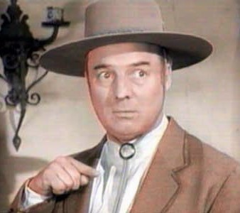

# Bernardo

A loyal companion to format usernames, subdomains and validate them against blacklists.  

Contains:

- a map for diacritics replacements;
- a long list of profanities and reserved words, in multiple languages;
- a PHP implementation.

A JS implementation may be coming up.  
More translations of reserved words could be welcomed.

## Getting started

Just use `src/bernardo-diacritics.json` or `src/bernardo-dictionnary.json` if you wish to!

Regarding PHP implementation:

```bash
$ composer require ssitu/bernardo
```

```php
use SSITU\Bernardo;

require_once 'path/to/autoload.php';

$Bernardo = new Bernardo();
# OR
$adtDictionnary = ['qwibqwib','jeffkoons'];
$Bernardo = new Bernardo($adtDictionnary); // will be added to the default one

# All-in-one methods:

$Bernardo->isValidSubDomain($entry, $returnSuggestion = false, $strict = true, $minLen = 4);
$Bernardo->isValidUsername($entry, $returnSuggestion = false, $strict = true, $minLen = 4);

# Cherry-pick methods:

// These 4 methods will handle diacritics substitution:
$Bernardo->formatSubdomain($entry, $minLen = 4);
$Bernardo->formatUsername($entry, $minLen = 4);
$Bernardo->format($entry, $pattern, $toLower = false, $minLen = 4);
$Bernardo->replaceDiacr($entry);

// For these 3, diacritics MUST have been handled beforehand (or expect possibly wrong returns):
$Bernardo->isValid($noDiacrEntry, $strict = true);
$Bernardo->strictExtractForbidden($noDiacrEntry, $stopAtFirst = false);
$Bernardo->extractForbidden($noDiacrEntry);

// Adjustements:
$Bernardo->cleanEntry($entry, $matches);
$Bernardo->forceLength($entry, $minLen = 4);
```

You can also take a look at `src/php/Bernardo_test.php`.

### Too severe?

I suggest to make easily accessible to your users a small, dedicated contact form, in case they feel the filter is too restrictive.

## Credits

Rodrigo De Almeida Siqueira (ex-project: postbit.com)  
https://github.com/michaldudek/subdomain-blacklist  
https://github.com/ConsoleTVs/Profanity  

## Contributing

Sure! :raised_hands:
You can take a loot at [CONTRIBUTING](CONTRIBUTING.md).  

## License

This project is under the MIT License; cf. [LICENSE](LICENSE) for details.


